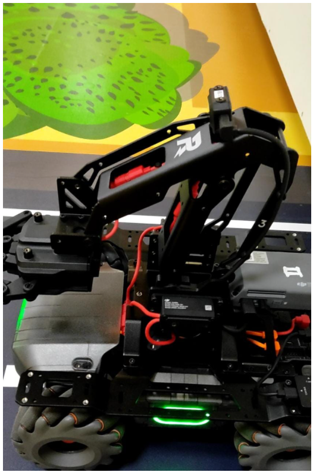
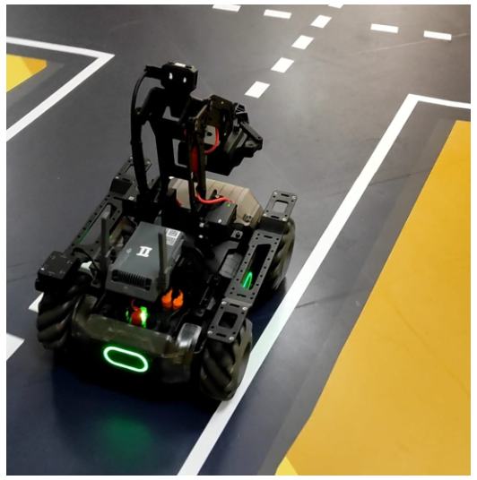
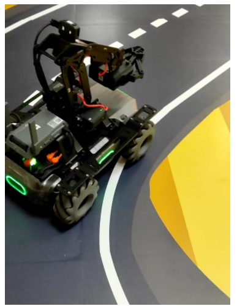

# MobileRobot-Openloopcontrol
## Aim:

To develop a python control code to move the mobilerobot along the predefined path.

## Equipments Required:
1. RoboMaster EP core
2. Python 3.7

## Procedure:

## Step1:

Use from robomaster import robot

## Step 2:

Choose the x,y,z - axis movement distance(meters).

## Step 3:

Give ep_chassis.move to move straight.

## Step 4:

Give time.sleep() for a break.

## Step 5:

Give ep_chassis.drive_speed to have a circular movement.


## Program:
```
### Developed by: Sudharshna Lakshmi.S
### Register Number: 212221230110

from robomaster import robot
import time

if __name__ == '__main__':
    ep_robot = robot.Robot()
    ep_robot.initialize(conn_type="ap")

    ep_chassis = ep_robot.chassis
    ep_led = ep_robot.led

    '''
    x = x-axis movement distance,( meters) [-5,5]
    y = y-axis movement distance,( meters) [-5,5]
    z = rotation about z axis ( degree)[-180,180]
    xy_speed = xy axis movement speed,( unit meter/second) [0.5,2]
    '''

    ep_chassis.move(x=4.5, y=0, z=0, xy_speed=0.75).wait_for_completed()
    time.sleep(2)
    ep_chassis.drive_speed(x=0.3,y=0,z=20)
    time.sleep(7)
    ep_chassis.move(x=3.5, y=0, z=0, xy_speed=0.75).wait_for_completed()
    time.sleep(2)
    ep_chassis.drive_speed(x=0.4,y=0,z=20)
    time.sleep(20)

    for i in range(10):
        ep_led.set_led(comp="all",r=255,g=0,b=0,effect="on")   
        time.sleep(2)
        ep_led.set_led(comp="all",r=0,g=255,b=0,effect="on")
        time.sleep(2)
    
    ep_robot.close()
```

## MobileRobot Movement Image:





## MobileRobot Movement Video:

https://youtube.com/shorts/ZPZTXI2s8gE?feature=share

## Result:
Thus the python program code is developed to move the mobilerobot in the predefined path.


<br/>
<br/>

```
Mobile Robotics Laboratory
Department of Artificial Intelligence and Data Science/ Machine Learning
Saveetha Engineering College
```
